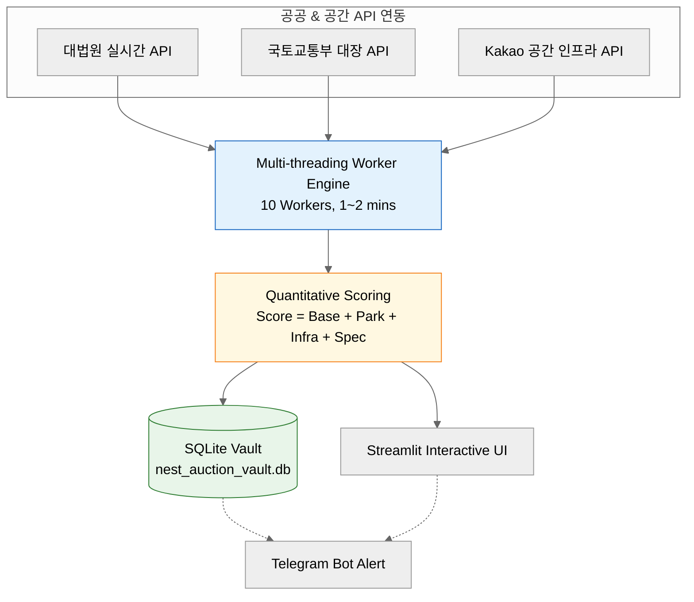

# 🏡 NEST (Niche Estate Screening Tool)


> **개인의 취향을 담은 삶의 터전을 찾는 정량적 경매 매물 분석 시스템**  
> **A personalized court auction analytics engine tailored for unique living styles and optimal environment search.**


---


## 💡 Project Vision & Background


**"집을 구하는 기준은 사람마다 다릅니다 (Everyone has different criteria when choosing a home)."**


**KR**: 누군가는 화려한 역세권 상권이나 높은 시세 차익을 중요시 하지만, 또 다른 누군가는 **소음 없는 조용한 환경, 일조량이 풍부한 상층부, 깊은 몰입을 돕는 서재나 작업실 인근의 공간, 그리고 언제든 걸어갈 수 있는 산책로**를 중요하게 생각합니다.


NEST는 보편적이고 기계적인 부동산 수치나 단순 투자 수익률 계산에서 벗어나, 새가 아무곳에나 둥지를 짓지 않듯 '**내가 진정으로 머물고 싶은 보금자리(Nest)**'를 발견하기 위해 기획된 개인 맞춤형 스크리닝 파이프라인 프로젝트입니다.


NEST는 수많은 경매 매물의 입지·건물 데이터 신호를 정량적으로 분석하여 각자의 삶의 가치관과 환경적 취향에 부합하는 공간 의사결정(Personalized Decision Support System)을 지원합니다.

**EN**: While some prioritize vibrant commercial districts near stations or high investment returns, others value **a quiet and peaceful environment, well-lit upper floors, nearby study or workspace areas that foster deep focus, and walkable green trails.**

Moving away from generic real estate metrics and simple ROI calculations, NEST is a personalized screening pipeline project designed to help you find **"a true sanctuary (Nest) where you genuinely want to stay"** —just as a bird thoughtfully chooses where to build its nest.

NEST quantitatively analyzes spatial and structural data signals from numerous court auction properties, providing a Personalized Decision Support System aligned with individual lifestyle values and environmental preferences.


### Key Criteria (Personalized Screening Rules)
* **조용함과 채광**: 층간소음에서 비교적 자유롭고 채광이 우수한 상층부/탑층 우대 및 엘리베이터 보유 여부 검증
* **작업 및 휴식 인프라**: 반경 내 공원·녹지 접근성 및 집중할 수 있는 서재·도서관·스터디 공간 밀집도 정량 측정
* **안전 및 환경 리스크 배제**: 위반건축물, 과도한 유찰 매물, 유흥가 반경 내 야간 소음 구역 자동 필터링


---


## 📌 Key Highlights


* **고속 동시성 분석 Engine**: `ThreadPoolExecutor` 기반 multi-threading(10+ workers)을 적용해 700개 이상의 서울 법원 매물을 **1~2분 내 수집 및 융합 검증**.
* **3-Way Data Fusion**: 대법원 실시간 경매 API + 국토교통부 건축물대장 API + 카카오 로컬 공간 API 정밀 연동.
* **Vault Persistence**: 검증을 통과한 매물 데이터를 SQLite 데이터베이스(`nest_auction_vault.db`)에 원자적(Atomic)으로 저장하여 중복 검증 오버헤드 방지.
* **Interactive Dashboard & Alerts**: `Streamlit` 기반 데이터 분석·Pydeck 3D 지도 시각화 대시보드 및 취향 부합 상위 매물 `Telegram Bot` 자동 리포트 전송.


---


## 🛠 Tech Stack


| 구분 | 기술 스택 | 주요 역할 |
| :--- | :--- | :--- |
| **Language** | `Python 3.10+` | 백엔드 파이프라인, 정량 스코어링 알고리즘 및 데이터 수집 |
| **Frontend / Web UI** | `Streamlit` | 웹 인터랙티브 대시보드 구축 및 Caching(`st.cache_data`) 적용 |
| **Visualization** | `Plotly Express`, `Pydeck` | 점수 분포/산점도 통계 차트 및 3D GIS 위치 시각화 |
| **Database** | `SQLite3`, `Pandas` | 검증 매물 DB 영속성 보관, 중복 처리 방지 및 데이터프레임 연산 |
| **Public API / Geo** | `PublicDataReader`, `Kakao API` | 건축물대장 표제부 실시간 검증 및 지적도 인프라 수집 |
| **Concurrency / Network** | `ThreadPoolExecutor`, `Requests` | 고속 병렬 처리 워커 및 대법원 세션 동기화 HTTP 통신 |
| **Alerting** | `Telegram Bot API` | 개인 취향 맞춤 상위 스코어 매물 주간 자동 알림 발송 |


---


## 🏗 System Architecture


---
## 📂 Directory Structure

```text
NEST/
├── .streamlit/
│   └── secrets.toml    # KAKAO_API_KEY, PUBLIC_DATA_KEY, TELEGRAM Token
├── NEST_pipeline.py    # 수집, 인프라 분석, 정량 스코어링 & DB 영속성 백엔드
├── app.py  # Streamlit 기반 인터랙티브 분석 대시보드 UI
├── nest_auction_vault.db   # SQLite3 영속성 데이터베이스
├── requirements.txt    # 프로젝트 패키지 의존성 목록
└── README.md   # 프로젝트 문서
```
---
## 🚀 Getting Started
**1. Repository Clone & Installation**
```bash
git clone https://github.com/your-username/NEST.git
cd NEST
pip install -r requirements.txt
```
**2. Environment Variables Setup (.streamlit/secrets.toml or .env)**
```Ini
KAKAO_API_KEY = "YOUR_KAKAO_REST_API_KEY"
PUBLIC_DATA_SERVICE_KEY = "YOUR_PUBLIC_DATA_PORTAL_KEY"
TELEGRAM_BOT_TOKEN = "YOUR_TELEGRAM_BOT_TOKEN"
TELEGRAM_CHAT_ID = "YOUR_TELEGRAM_CHAT_ID"
```
**3. Run Application**
```bash
# Backend Pipeline & DB Update
python NEST_pipeline.py

# Streamlit Dashboard UI Run
streamlit run app.py
```
---
## ☁️ Deployment Guide
1. 본 Repository를 GitHub에 Push합니다. 

2. Streamlit Community Cloud에 접속하여 저장소와 app.py를 연결합니다.

3. 앱 설정의 Secrets 항목에 .streamlit/secrets.toml에 포함된 API 키 정보를 등록하고 Deploy를 완료합니다.
---
## 📜 License & Terms of Use / 라이선스 및 이용 조건

**Copyright (c) 2026 Min Kyung Kim (MK). All Rights Reserved.**

* **KR**: 본 프로젝트의 소스 코드는 이력서 및 포트폴리오 검증 목적으로 공개되어 있으며, 저작권자의 서면 동의 없는 **무단 복제, 수정, 재배포 및 상업적 이용을 엄격히 금지**합니다.
* **EN**: This repository is made publicly viewable strictly for portfolio and evaluation purposes. **Unauthorized copying, modification, redistribution, or commercial use of this codebase without explicit written permission is strictly prohibited.**