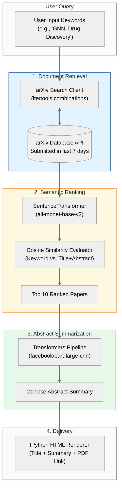

# 🤖 ResearchMate: AI Academic Paper Search & Summarizer Agent

> **Automated arXiv paper discovery, vector similarity-based ranking, and abstract summarization agent.**

ResearchMate는 다량의 최신 논문 속에서 사용자의 핵심 관심사에 부합하는 연구를 자동으로 수집, 정렬 및 요약해 주는 AI 에이전트 파이프라인입니다. 최근 7일간 arXiv에 등록된 최신 논문을 대상으로 연관 키워드 필터링, 임베딩 기반 코사인 유사도 평가, BART 기반 요약 생성을 거쳐 최적의 논문 Briefing을 생성합니다.

---
## 🔑 Key Features
1. Customized Multi-Keyword Search
* 사용자 지정 키워드 조합(최소 2개 이상 교집합 조건)을 조합하여 arXiv 최신 논문을 검색합니다.
* 최근 7일간 발행된 최신 연구 자산만을 대상으로 타겟팅합니다.

2. Vector Similarity-Based Ranking (Embedding Grounding)
* all-mpnet-base-v2 모델을 사용하여 입력 키워드와 논문 제목/초록(Title + Abstract) 간의 의미론적(Semantic) 임베딩 벡터를 추출합니다.
* 코사인 유사도(Cosine Similarity) 평점을 기반으로 정렬하여 상위 10개의 핵심 논문을 자동 선별합니다.

3. Automated Abstract Summarization
* Pre-trained facebook/bart-large-cnn 요약 파이프라인을 활용해 논문 초록의 핵심 내용을 150자 이내의 원페이지 요약문으로 변환합니다.

4. Rich HTML Output Rendering
* Jupyter / Kaggle 및 웹 환경에서 즉시 가독성을 확보할 수 있도록 원문 PDF 직링크가 포함된 규격화된 HTML 리포트를 출력합니다.

---
## 🏗️ System Architecture

---
## 🛠️ Tech Stack & GenAI Capabilities
| 영역 | 기술 / 라이브러리 | 용도 |
| :--- | :--- | :--- |
| **Language & Environment** | Python 3.x, PyTorch, CUDA | GPU 가속 기반 딥러닝 연산 환경 구축 |
| **API Integration** | arxiv, itertools | arXiv RESTful Querying & 키워드 조합 생성 |
| **Embeddings & Vector Search** | sentence-transformers (all-mpnet-base-v2), scikit-learn | 의미론적 벡터 변환 및 코사인 유사도 산출 |
| **Summarization Engine** | transformers (facebook/bart-large-cnn) | Abstract 요약문 생성 파이프라인 |
| **Interactive UI** | IPython.display | Notebook 기반 HTML 대시보드 렌더링 |

### 💡 Core Generative AI Capabilities Integrated
* **RAG & Grounding**: 외부 arXiv 데이터베이스 실시간 수집을 통해 환각 현상 없이 사실 기반 요약문 생성.
* **Vector Search**: Sentence Embedding을 통한 논문-키워드 간 고차원 공간 유사도 측정.
* **Context Caching & Model Reuse**: 메모리 최적화를 위해 임베딩 및 요약 모델을 GPU 메모리에 최초 1회 로딩 후 재활용.
* **Autonomous Agent Pipeline**: 검색, 필터링, 순위 매기기, 요약, HTML 출력까지 완전 자동화된 워크플로우 수행.
---
## 📂 Project Structure
```text
ResearchMate/
├── ResearchMate.ipynb       # Kaggle/Jupyter 가동용 메인 노트북 코드
├── README.md                # 프로젝트 문서
└── requirements.txt         # 종속성 라이브러리 목록
```
---
## 🚀 Quick Start
**1. Prerequisites**
Python 3.8 이상과 GPU(CUDA 지원 환경 권장) 환경에서 실행을 권장합니다.
```bash
pip install torch arxiv sentence-transformers transformers scikit-learn
```
**2. Execution in Jupyter / Kaggle**
* `ResearchmMate.ipynb` 파일 또는 메인 스크립트를 실행합니다.
* 터미널/콘솔 입력창에 탐색하려는 키워드를 반점(,)으로 구분하여 입력합니다.
```text
Enter keywords separated by commas (searching papers from the last 7 days, with at least 2 in AND):
> Graph Neural Network, Drug Discovery, Molecular Property
```
* 실행이 완료되면 상위 10개 논문의 요약문과 원문 URL이 정리된 HTML 리포트가 노트북 셀 하단에 바로 표시됩니다.
---
## Configuration Parameters
`ResearchMate.ipynb` 내 상단 설정부에서 검색 파라미터를 조절할 수 있습니다:
```python
NUM_ARTICLES_PER_KEYWORD = 50  # 키워드 조합당 수집할 최대 논문 수
NUM_ARTICLES_TO_SUMMARIZE = 10  # 최종 요약할 상위 논문 개수
MIN_KEYWORDS_MATCH = 2  # 논문 탐색 시 최소 포함되어야 할 키워드 개수
SEARCH_TERM = 7  # 탐색 대상 기간 (현재 날짜 기준 과거 N일)
```
---
## 📜 License
This project is open-source and available under the [MIT License](LICENSE).